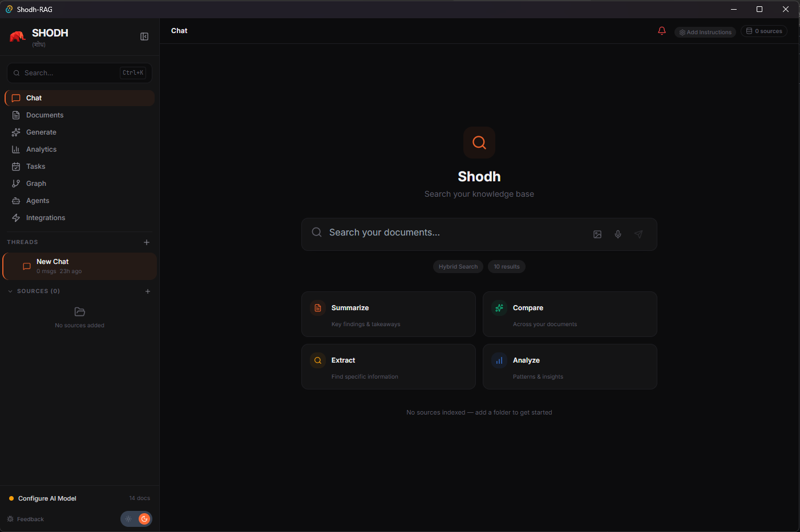
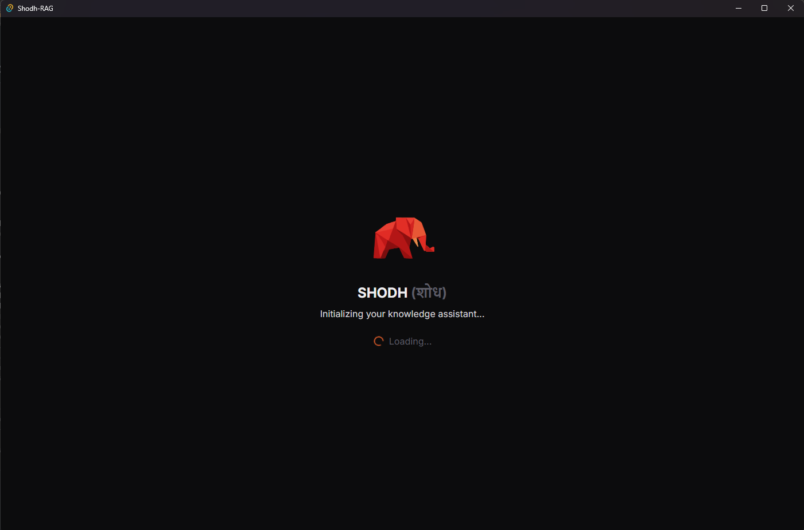
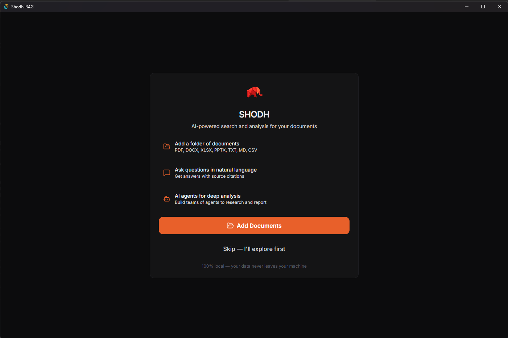

<p align="center">
  
</p>

<h1 align="center">Shodh</h1>

<p align="center">
  <strong>Local-first AI assistant with RAG, agents, and tool calling — built entirely in Rust.</strong>
</p>

<p align="center">
  <a href="#features">Features</a> &middot;
  <a href="#quickstart">Quickstart</a> &middot;
  <a href="#architecture">Architecture</a> &middot;
  <a href="#llm-providers">LLM Providers</a> &middot;
  <a href="#contributing">Contributing</a>
</p>

<p align="center">
  <a href="https://github.com/varun29ankuS/shodhRAG/blob/master/LICENSE"></a>
  
  
  
</p>

---

**Shodh** (Sanskrit: शोध — "research") is an open-source, local-first AI assistant that runs entirely on your machine. It combines a production-grade RAG engine (LanceDB + Tantivy), a multi-agent framework with tool calling, and a polished desktop UI — all wrapped in a single Tauri binary. No cloud required. Your data never leaves your device.

<p align="center">
  
</p>

<p align="center">
  
  &nbsp;&nbsp;
  
</p>

## Why Shodh?

Most RAG tools are either cloud-locked SaaS products or Python scripts held together with duct tape. Shodh is different:

- **Truly local.** Your documents, embeddings, and conversations stay on your machine. Plug in a local LLM (Ollama, Phi, Mistral) and go fully offline.
- **Fast.** The core engine is pure Rust — vector search, full-text indexing, document parsing, embedding, and reranking all run natively. No Python runtime. No Docker.
- **Complete.** Not a library you wire up yourself. It's a full desktop app with chat, document management, agent builder, calendar, knowledge graph, analytics, and bot integrations — ready to use out of the box.
- **Extensible.** Swap LLM providers with a click. Add tools via MCP protocol. Build multi-agent crews. Connect Discord, Telegram, or Google Drive.

## Features

### RAG Engine
- **Hybrid search** — vector similarity (LanceDB) + full-text (Tantivy), merged with reciprocal rank fusion
- **20+ file formats** — PDF, DOCX, XLSX, PPTX, Markdown, HTML, CSV, JSON, and 15+ programming languages
- **Windows OCR** — automatic text extraction from scanned documents and images
- **Semantic chunking** — configurable chunk size, overlap, and minimum thresholds
- **Cross-encoder reranking** — ms-marco-MiniLM for relevance scoring
- **Citation tracking** — every response links back to source documents with page/chunk references
- **Multi-space** — organize documents into separate knowledge bases

### Agent System
- **ReAct tool loop** — agents reason, pick tools, execute them, observe results, and iterate
- **Built-in tools** — RAG search, file operations, calendar management, code analysis
- **MCP protocol** — plug in any Model Context Protocol server for additional tools
- **Crew orchestration** — chain multiple agents in sequential or hierarchical workflows
- **Agent builder UI** — create and configure agents visually, no code needed

### Chat Interface
- **Streaming responses** — real-time token output from any provider
- **Artifact rendering** — code blocks with syntax highlighting, Mermaid diagrams, tables, charts
- **Tool call visualization** — see exactly what tools agents use and why
- **Citation footnotes** — click to jump to source documents
- **Command palette** — Cmd+K for quick actions

### LLM Providers

Use any combination of local and cloud models:

| Provider | Models | Local? |
|----------|--------|--------|
| **Ollama** | Llama, Mistral, Phi, Qwen, Gemma, CodeLlama, ... | Yes |
| **ONNX Runtime** | Phi-3 Mini, Phi-4, Mistral 7B, Orca 2, Qwen2, Gemma 2B | Yes |
| **OpenAI** | GPT-4o, GPT-4 Turbo, GPT-4o Mini | No |
| **Anthropic** | Claude 3 Opus, Sonnet, Haiku | No |
| **Google Gemini** | 2.5 Pro, 2.0 Flash, 1.5 Pro | No |
| **OpenRouter** | 200+ models (DeepSeek, Llama, Gemini, etc.) | No |
| **Grok (xAI)** | Grok 2, Grok 2 Vision | No |
| **Perplexity** | Sonar (with live web search) | No |

Switch providers at runtime — no restart needed.

### Integrations
- **Google Drive** — OAuth2 sync, auto-index documents from selected folders
- **Discord bot** — serve your knowledge base to an entire server
- **Telegram bot** — personal assistant via chat commands
- **WhatsApp bridge** — message-based access to your knowledge base

### More
- **Calendar & tasks** — create events, manage todos, agents can schedule on your behalf
- **Document generation** — export responses as PDF, Word, Excel, or CSV
- **Knowledge graph** — interactive 3D force-directed visualization of document relationships
- **Analytics dashboard** — query metrics, token usage, agent performance charts
- **Dark/light theme** — system-aware with manual toggle

## Quickstart

### Prerequisites

- [Rust](https://rustup.rs/) 1.75+
- [Node.js](https://nodejs.org/) 18+ and npm
- Platform build tools:
  - **Windows:** [Microsoft C++ Build Tools](https://visualstudio.microsoft.com/visual-cpp-build-tools/)
  - **macOS:** `xcode-select --install`
  - **Linux:** `sudo apt install build-essential libssl-dev libwebkit2gtk-4.1-dev`

### Build & Run

```bash
git clone https://github.com/varun29ankuS/shodhRAG.git
cd shodhRAG/app
npm install
npm run tauri dev
```

That's it. The app opens with an onboarding flow to configure your first LLM provider.

### Production Build

```bash
npm run tauri build
```

Outputs a platform-native installer in `app/src-tauri/target/release/bundle/`.

### Using the RAG Library Standalone

The core engine is a regular Rust crate — use it in your own projects:

```toml
# Cargo.toml
[dependencies]
shodh-rag = { path = "crates/shodh-rag" }
```

```rust
use shodh_rag::rag_engine::{RAGEngine, RAGConfig};

let config = RAGConfig::new("./my_data");
let mut engine = RAGEngine::new(config).await?;

// Ingest a document
engine.add_document("content here", DocumentFormat::TXT, metadata, citation).await?;

// Search
let results = engine.hybrid_search("your query", 10).await?;
```

## Architecture

```
shodh/
├── crates/shodh-rag/        # Core RAG engine (pure Rust library)
│   └── src/
│       ├── rag_engine.rs     # Pipeline orchestration
│       ├── storage/          # LanceDB vector store
│       ├── search/           # Hybrid search (vector + full-text)
│       ├── embeddings/       # E5 multilingual (ONNX)
│       ├── reranking/        # Cross-encoder scoring
│       ├── processing/       # Document parsing + OCR
│       ├── llm/              # Multi-provider LLM manager
│       ├── agent/            # Agent framework + tool loop
│       ├── chat/             # Conversation engine + intent routing
│       ├── graph/            # Knowledge graph (petgraph)
│       └── memory/           # Conversation memory
│
├── app/
│   ├── src/                  # React 19 + TypeScript frontend
│   │   ├── components/       # 50+ UI components
│   │   ├── contexts/         # Theme, sidebar, permissions
│   │   ├── hooks/            # Custom React hooks
│   │   └── services/         # Tauri IPC wrappers
│   │
│   └── src-tauri/            # Tauri desktop shell (Rust)
│       └── src/
│           ├── rag_commands.rs
│           ├── agent_commands.rs
│           ├── llm_commands.rs
│           ├── calendar_commands.rs
│           ├── mcp/              # MCP protocol server
│           └── [40+ command modules]
│
├── Cargo.toml                # Workspace root
└── LICENSE                   # Apache 2.0
```

### Data Flow

```
User query
  → Intent router (deterministic + LLM-based classification)
    → Search: hybrid retrieval → rerank → context assembly → LLM generation
    → Tool action: ReAct loop (LLM → tool call → execute → observe → repeat)
    → Agent chat: agent-specific prompt + tools + memory
    → General: direct LLM completion with conversation history
  → Streaming response with citations
```

### RAG Pipeline

```
Document  →  Parse (PDF/DOCX/code/...)  →  Chunk (semantic splitting)
          →  Embed (E5 multilingual, 768d)  →  Store (LanceDB + Tantivy)

Query  →  Embed  →  Vector search (ANN)  ─┐
                 →  Full-text search ──────┤
                                           └→  RRF merge  →  Rerank  →  LLM
```

## Tech Stack

| Layer | Technology |
|-------|-----------|
| Desktop shell | Tauri 2.0 |
| Frontend | React 19, TypeScript 5.8, Vite 6, Tailwind CSS |
| Backend | Rust (pure, no Python) |
| Vector DB | LanceDB 0.26 + Apache Arrow |
| Full-text search | Tantivy 0.22 |
| Embeddings | E5 multilingual base (ONNX Runtime) |
| Reranking | ms-marco-MiniLM cross-encoder |
| Knowledge graph | petgraph |
| LLM inference | ONNX Runtime, llama.cpp (GGUF), HTTP APIs |
| Charts | Recharts, Mermaid |
| Graph viz | react-force-graph-3d |
| Code editor | Monaco Editor |
| Animations | Framer Motion |

## Configuration

### LLM Setup

Open Settings in the app sidebar to configure your LLM provider. For cloud providers, enter your API key. For local models:

**Ollama (recommended for local):**
```bash
# Install Ollama: https://ollama.ai
ollama pull llama3.2
# Shodh auto-detects Ollama at localhost:11434
```

**ONNX local models:**
Place model files in your app data directory:
- Windows: `%APPDATA%\shodh\models\`
- macOS: `~/Library/Application Support/shodh/models/`
- Linux: `~/.config/shodh/models/`

### Embedding Model

Shodh uses [E5 multilingual base](https://huggingface.co/intfloat/multilingual-e5-base) for embeddings. On first run, the model is loaded from the `models/` directory. Download the ONNX variant from HuggingFace and place it in the models directory.

## Contributing

Contributions are welcome. Please follow these guidelines:

1. **Fork and branch** — create a feature branch from `master`
2. **No placeholders** — production-grade code only. No TODOs, mocks, or stubs.
3. **Test your changes** — `cargo test --workspace`
4. **Keep PRs focused** — one feature or fix per PR
5. **Describe the why** — commit messages should explain intent, not just what changed

```bash
# Run tests
cargo test --workspace

# Check formatting
cargo fmt --check

# Lint
cargo clippy --workspace
```

### Project Priorities

- Performance and correctness over features
- Local-first always — cloud should be optional
- Minimal dependencies — every crate addition needs justification
- Cross-platform — Windows, macOS, and Linux must all work

## Roadmap

- [ ] Voice mode — local TTS/STT via Sherpa-ONNX (Hindi + English)
- [ ] Semantic calendar indexing — tasks discoverable via RAG search
- [ ] Slack and Teams integrations
- [ ] Web interface (alongside desktop)
- [ ] Plugin system for custom tools
- [ ] Improved GPU acceleration for embeddings

## License

[Apache License 2.0](LICENSE) — Copyright 2025 Shodh
